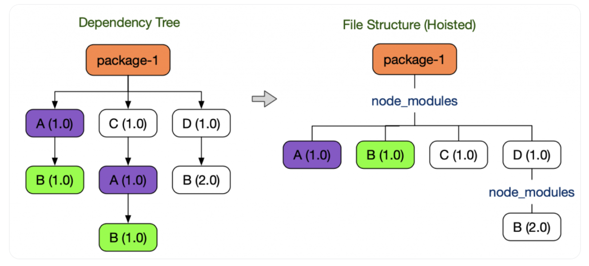
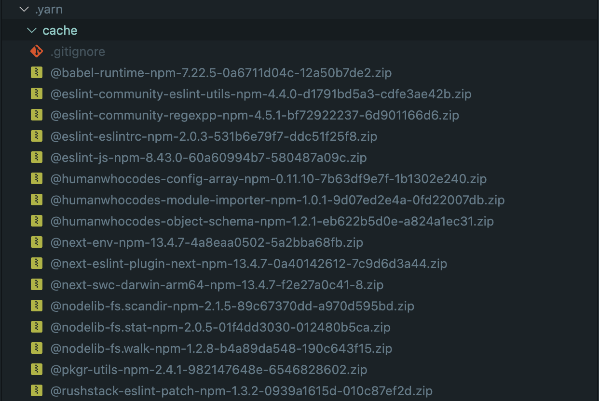
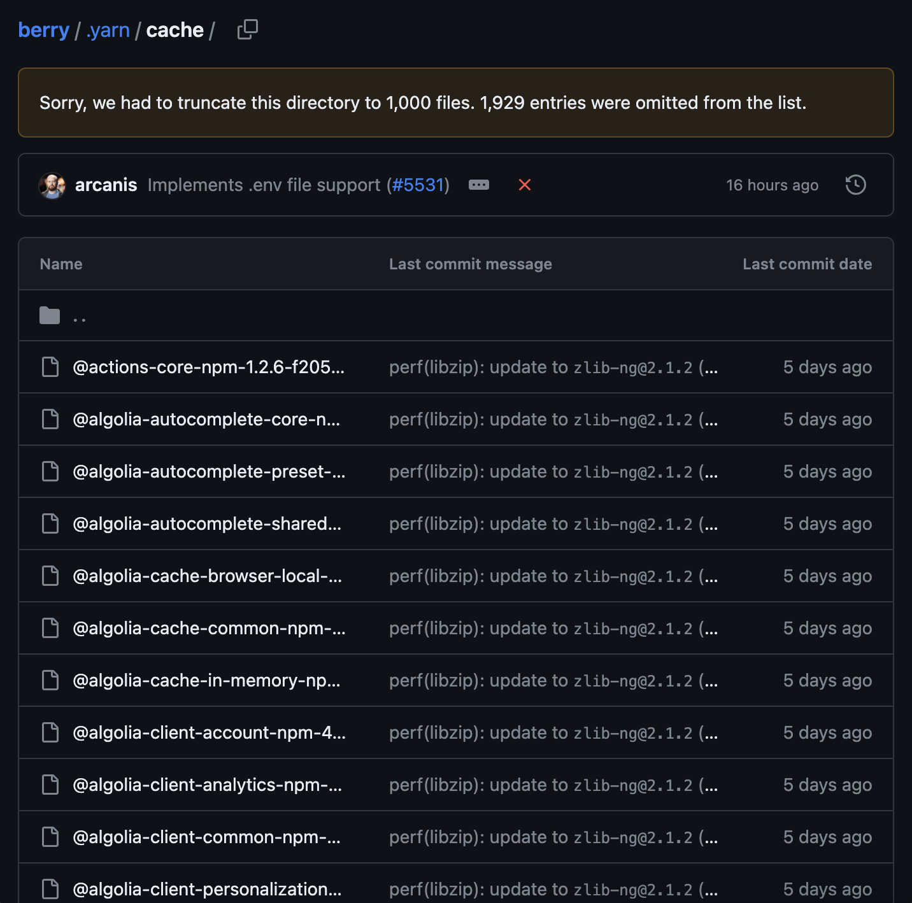

4월부터 계획한 사이드 프로젝트를 진행 중에 코드나 디자인, 설계가 맘에 들지 않았고 그 와중에 Next.js 13 stable 버전이 나왔길래 프로젝트를 엎기로 했다. 그러면서 내 눈에 띈 것이 있는데 그게 바로 Yarn berry였고 한 번 도입해보는 것도 괜찮겠다 싶어 블로그를 통해 공유해보고자 한다.

# Yarn Berry란?

Yarn Berry는 Node.js를 위한 새로운 패키지 매니저로, 기존 NPM 패키지 매니저의 문제점을 개선하고자 만들어졌다. 현재 소스코드는 [yarnpkg/berry](https://github.com/yarnpkg/berry) 에서 관리되고 있으니 궁금하신 분들은 확인해보시길 바란다.

# NPM의 문제점

## 비효율적인 의존성 검색

NPM은 파일 시스템을 이용하여 의존성을 관리한다. node_modules 폴더 구조하에서 모듈을 검색하는 방식(디스크 I/O)이다.

예를 들어 `/home/ry/projects/foo.js` 에서 `require('bar.js')` 를 탐색할 경우,

```
/home/ry/projects/node_modules/bar.js
/home/ry/node_modules/bar.js
/home/node_modules/bar.js
/node_modules/bar.js
```

이처럼 매 탐색마다 패키지를 찾기 위해서 계속 상위 디렉토리의 node_modules 폴더를 탐색한다. 경우에 따라서는 순회해야 하는 경로가 더욱 복잡해질 수도 있다.

## 비효율적인 설치

패키지 설치 과정의 경우에도 마찬가지이다. 설치 과정에 필요한 최소 동작만으로도 이미 비용이 많이 들고 있기 때문에 각 패키지 간 의존 관계가 유효한지 등의 추가적인 검증에 리소스를 할당하기 어렵다. 예를 들어, 수 백개의 패키지가 서로를 의존하는 복잡한 의존성 트리에서 node_modules 디렉토리 구조는 점점 깊어지며, 깊어진 트리 구조에서 의존성이 잘 설치되어 있는지 검증하려면 많은 수의 I/O 호출이 필요하다.

## 유령 의존성 (Phantom Dependency)



NPM이나 Yarn v1에서는 중복 설치되는 node_modules를 아끼기 위해 Hoisting 기법을 사용한다. 그렇게 하면 패키지 최상위에서 트리 깊이 탐색하지 않고 루트 경로에서 원하는 패키지를 탐색할 수 있으므로 효율적이기 때문이다.

하지만 문제는 Hoisting에 따라 직접 의존하고 있지 않은 라이브러리를 의존하는 경우가 있는데, 이를 `유령 종속성`이라고 한다.

유령 의존성 현상이 발생하면 package.json에 명시하지 않은 라이브러리를 사용할 수 있거나, 다른 의존성을 제거했을 때 같이 사라지기도 한다. 이런 특성은 의존성 트리의 유효성을 검증하기 힘들다.

# Plug'n'Play (PnP)

Yarn Berry는 이를 해결하기 위해 Plug'n'Play 전략을 이용한다.



Yarn Berry는 node_modules를 사용하지 않는다. 대신 `.yarn` 경로 하위에 의존성들을 `.zip` 포맷으로 압축 저장하고, `.pnp.cjs` 파일을 생성 후 의존성 트리 정보를 단일 파일에 저장한다. 이를 `인터페이스 링커 (Interface Linker)` 라고 한다.

## ZipFS (Zip Filesystem)

zip으로 묶인 라이브러리가 저장된 `.yarn/cache` 폴더가 ZipFS라고 불린다. Yarn PnP 시스템에서 각 의존성은 Zip으로 관리된다. Zip 아카이브로 의존성을 관리하면 다음과 같은 장점이 생긴다.

1.  더 이상 node_modules가 필요가 없어 설치가 빠르다.
2.  각 패키지는 버전마다 하나의 Zip 아카이브만을 가지기 때문에 중복해서 설치되지 않습니다. 각 Zip 아카이브가 압축되어 있음을 고려할 때, 스토리지 용량을 크게 아낄 수 있다.
3.  의존성을 구성하는 파일의 수간 많지 않으므로, 변경 사항을 감지하거나 전체 의존성을 삭제하는 작업이 빠르다.

## Zero-Install

Yarn Berry를 도입 시 가장 강조되어야 할 부분이 바로 Zero-Install다. Zero-Install이란 의존성을 Git 등을 이용하여 버전 관리를 하는 것이다.

Yarn PnP는 의존성을 압축 파일로 관리하기 때문에 의존성의 용량이 작다. 또한 각 의존성은 하나의 Zip 파일로만 표현되기 때문에 node_modules보다 파일의 숫자가 적다. 일반적으로 node_modules는 1.2GB 크기에 10만개가 넘어가는 파일로 구성되어 있다. 반면, Yarn PnP의 의존성은 139MB 크기의 약 2천개 압축 파일로 구성되어 있다.



Yarn Berry Git 레포지토리에서 사용하는 Zero-Install

의존성을 버전 관리에 포함하면 다음과 같은 장점이 있다.

1. 새로 저장소를 복제하거나 브랜치를 바꾸었다고 해서 yarn install을 실행하지 않아도 된다.
2. CI에서 의존성 설치하는 시간을 크게 절약할 수 있다.

# References

- [Yarn](https://yarnpkg.com/configuration/yarnrc)
- [Toss Tech Blog](https://toss.tech/article/node-modules-and-yarn-berry)
- [Remember Web](https://blog.dramancompany.com/2023/02/%EB%A6%AC%EB%A9%A4%EB%B2%84-%EC%9B%B9-%EC%84%9C%EB%B9%84%EC%8A%A4-%EC%A2%8C%EC%B6%A9%EC%9A%B0%EB%8F%8C-yarn-berry-%EB%8F%84%EC%9E%85%EA%B8%B0/)
